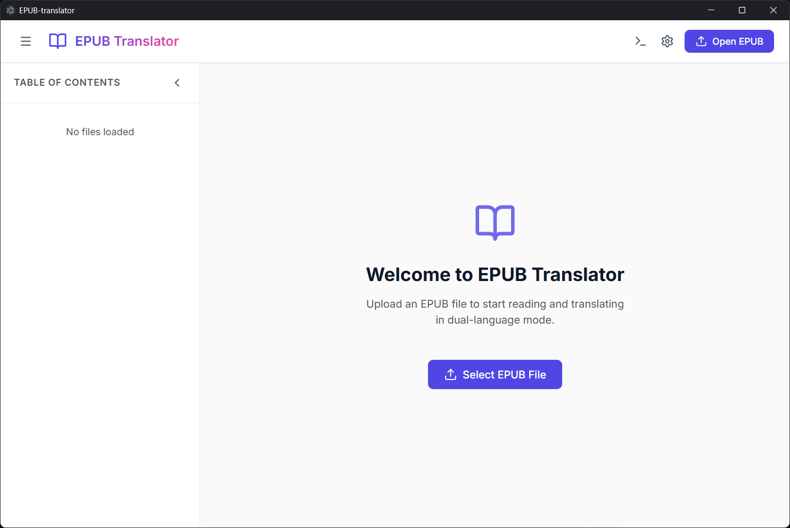
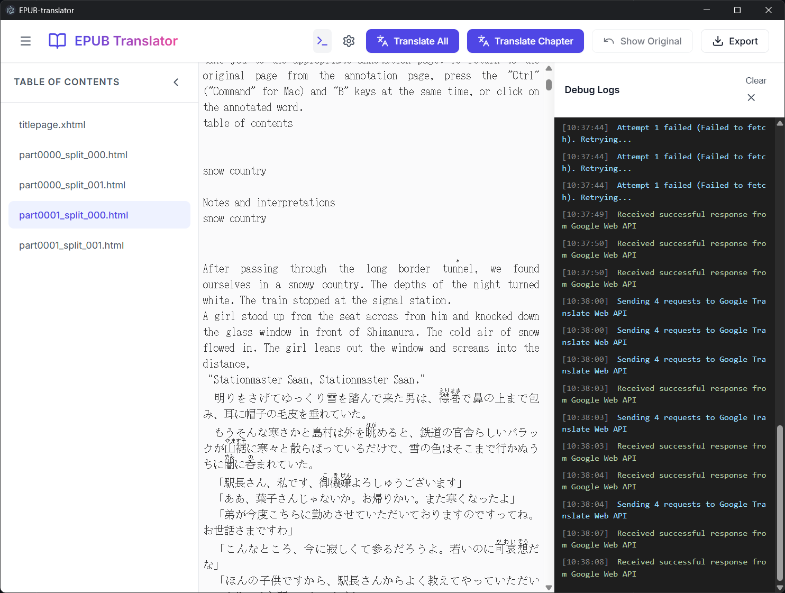

# EPUB Translator

A powerful, high-performance, and immersive desktop EPUB translation tool built with Electron, React, and Vite. Designed to bypass CORS restrictions natively, it allows users to translate EPUB books seamlessly using the free Google Translate Web API, DeepSeek, OpenAI, Gemini, or any custom API—all without relying on heavy backend proxies.

## Features

- **Full AI Model Support**: Seamlessly integrate with mainstream AI providers (OpenAI, Gemini, DeepSeek, etc.) or use any custom API endpoints.
- **Immersive Bilingual Reading**: Translations are displayed directly beneath the original text, preserving layout and scroll position.
- **Format Integrity**: Robust parsing ensures that original EPUB structures, images, and complex styles remain intact.

## preview




##  Quick Start

### Prerequisites
- Node.js (v18 or higher recommended)
- npm or yarn

### Installation

1. Install dependencies:
```bash
npm install
```

2. Start the development server (Live Reloading):
```bash
npm run dev
```

### Building for Release

To package the application for your operating system:
```bash
npm run build
```
The packaged executable (e.g., `.exe` for Windows) will be generated inside the `dist/` directory (the exact path depends on electron-builder). 

##  Usage

1. **Load Book**: Click the "Open EPUB" button to load your local `.epub` file.
2. **Settings**: Click the gear icon to open Settings. 
   - Choose your translation provider (e.g., Google Translate Web Free, DeepSeek, OpenAI).
   - Insert your API Key if required.
   - Adjust concurrency levels based on your token limits.
3. **Translate**: Select a chapter from the sidebar and click "Translate Chapter", or click "Translate All" for a full book overhaul. 
4. **Export**: Click "Export" to download the finalized, fully translated `.epub` file directly to your system.

## Architecture & Tech Stack

- **Frontend**: React + TypeScript + Vite
- **Desktop Runtime**: Electron + `vite-plugin-electron`
- **EPUB Engine**: JSZip (for unpacking/repacking XML architecture)
- **Styling**: Pure CSS (minimalist and easily modifiable)

##  License

MIT License
