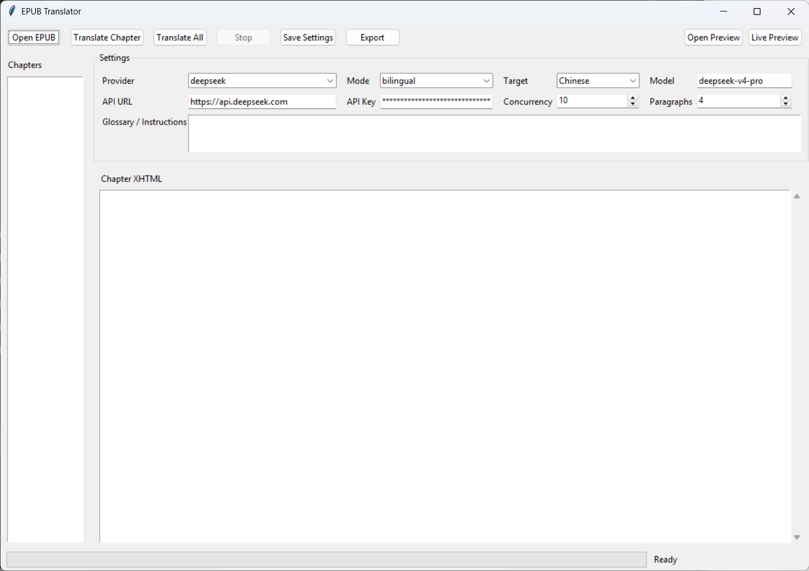
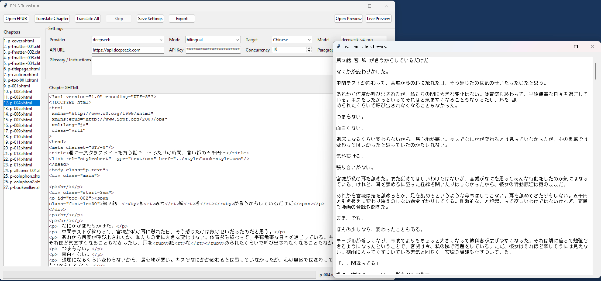

# EPUB Python Translator

This folder is a compact Python refactor of the original Electron EPUB translator.
It keeps the core workflow while removing the Node/Electron stack:

- Open and parse EPUB files directly with `zipfile` and OPF spine metadata.
- Translate one chapter or the whole book.
- Export a translated EPUB while preserving untouched assets, styles, images, and metadata.
- Use bilingual output or replace-original output.
- Support Google Translate Web, OpenAI-compatible APIs, DeepSeek, Ollama, Gemini, and custom endpoints.
- Reuse translation results through a local JSON cache.
- Run as either a Tkinter desktop app or a CLI tool.
- In bilingual mode, the original text is visually dimmed and left structurally intact; the translation is inserted as a separate block.
- The GUI can stop translation after the current in-flight request and can show a live readable preview window while translation is running.
- The GUI remembers provider, API key, model, API URL, mode, language, concurrency, paragraph batch size, and glossary settings.

## Install

```bash
cd translator
python -m pip install -r requirements.txt
```

## GUI

```bash
python -m epub_translator.gui
```

### Preview





## CLI

Translate a whole EPUB:

```bash
python -m epub_translator.cli input.epub output.epub --provider google-web --target "Chinese"
```

OpenAI-compatible example:

```bash
python -m epub_translator.cli input.epub output.epub ^
  --provider openai ^
  --api-key YOUR_KEY ^
  --model gpt-4.1-mini ^
  --target "Chinese" ^
  --mode bilingual
```

Ollama example:

```bash
python -m epub_translator.cli input.epub output.epub --provider ollama --model llama3 --target "Chinese"
```

For OpenAI-compatible providers, `--api-url` may be either the service root or the full chat-completions URL.
For example, `http://localhost:11434` is normalized to `http://localhost:11434/v1/chat/completions`.

## Notes

Google Web translation is free but unofficial and throttled. For long books, an API-backed provider is more stable.
The cache file defaults to `.translation_cache.json` in the current working directory.
GUI settings are saved as plain JSON at `~/.epub_translator/config.json`.
